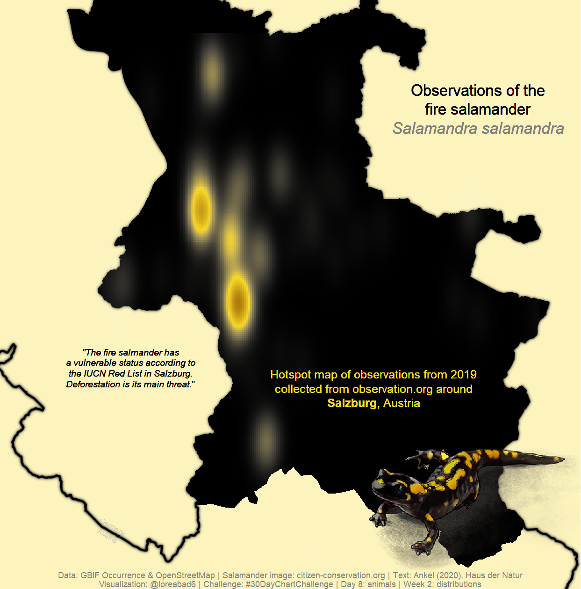

## #30DayChartChallenge

My contributions to the [#30DayChartChallenge](https://twitter.com/hashtag/30DayChartChallenge). 
Here are the prompts for reference:

Click on each chart to see the code.

### Day 1: part-to-whole - Week 1: Comparisons

### Day 2: pictogram - Week 1: Comparisons

### Day 3: historical - Week 1: Comparisons

### Day 4: magical - Week 1: Comparisons

### Day 5: slope - Week 1: Comparisons

### Day 8: animals - Week 2: Distributions

